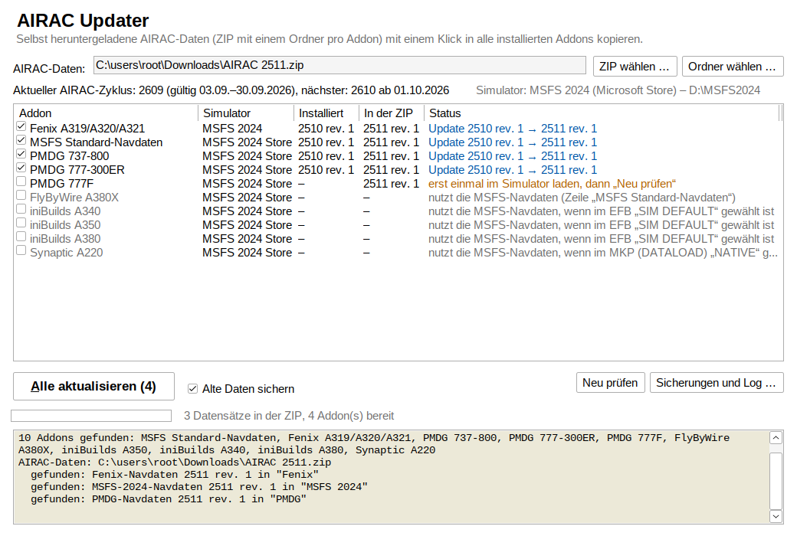
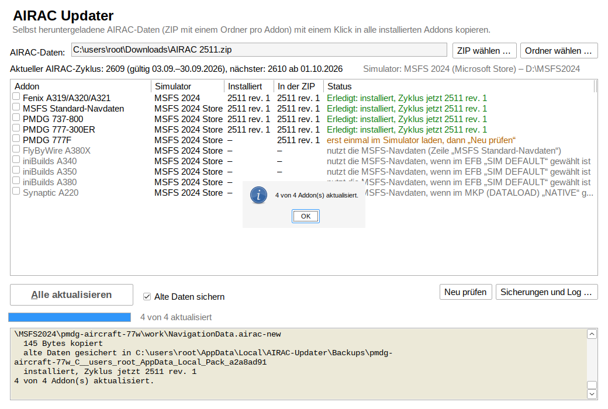

# AIRAC Updater

Ein kleines Windows-Programm, das AIRAC-Navdaten, die du selbst heruntergeladen hast, mit einem
Klick in alle installierten Addons kopiert. Es arbeitet wie ein Navdata-Manager, nur kommen die
Daten aus deiner eigenen ZIP. Das Programm lädt nichts aus dem Internet.



## So benutzt du es

1. [`AIRAC-Updater.exe`](AIRAC-Updater.exe) herunterladen: auf GitHub die Datei öffnen und
   **Download raw file** klicken. Es ist eine einzelne Datei ohne Installation. Windows 10 und
   11 bringen alles mit, was sie braucht (.NET Framework 4.8).
2. Microsoft Flight Simulator und die Fenix-App schließen.
3. Programm starten. Beim ersten Start meldet Windows „Der Computer wurde durch Windows
   geschützt“, weil die Datei nicht signiert ist: **Weitere Informationen → Trotzdem ausführen**.
4. **ZIP wählen …**, oder die ZIP auf das Fenster oder auf die exe ziehen.
5. **Alle aktualisieren** klicken (oder Alt+A).

Das Programm listet jedes gefundene Addon mit dem installierten Zyklus und dem Zyklus in der
ZIP. Angehakt sind alle, für die die ZIP neuere Daten hat. Die Häkchen kannst du ändern.



## Die ZIP

Eine ZIP oder ein Ordner mit einem Unterordner pro Addon. Wie die Ordner heißen, ist egal: Das
Programm erkennt die Daten an ihrem Inhalt. ZIP-Dateien in der ZIP entpackt es selbst.

```
AIRAC 2610.zip
├── MSFS 2024/        navigraph-nav-base\ und navigraph-nav-jepp\ (die zwei Pakete)
├── Fenix/            nd.db3, cycle_info.txt, cycle.json
├── PMDG/             e_dfd_PMDG.s3db, cycle.json, cycle_info.txt
└── iniBuilds/        (optional) cycle.json mit "dfdv2" und db.s3db
```

- **Ein Datensatz reicht für alle Flugzeuge mit demselben Format.** Der PMDG-Ordner geht in
  jede installierte 737 und 777, der Fenix-Ordner gilt für A319, A320 und A321.
- **Mehrere Datensätze derselben Art:** Der Ordnername entscheidet, z. B. geht „PMDG 777“ an die
  777er. Sonst gewinnt der neueste Zyklus.
- **`.7z`-Archive** kann das Programm nicht öffnen. Vorher entpacken.

## Was wohin kommt

| Addon | Erkannt in der ZIP an | Ziel auf dem PC |
| ----- | --------------------- | --------------- |
| MSFS 2024 Standard-Navdaten (Standardflugzeuge) | Ordnern `navigraph-nav-base` und `navigraph-nav-jepp` | `Community` des Simulators, oder `Community2024`, wenn sie dort schon liegen |
| MSFS 2020 Standard-Navdaten | Ordnern `navigraph-navdata-base` und `navigraph-navdata` | `Community` |
| Fenix A319/A320/A321 | `nd.db3` | `C:\ProgramData\Fenix\Navdata` |
| PMDG 737-600/-700/-800/-900, 777-200ER/-200LR/-300ER, 777F | `e_dfd_PMDG.s3db` | `…\WASM\MSFS2024\pmdg-aircraft-…\work\NavigationData`, je Flugzeug |
| iniBuilds A350, A340, A380 | `cycle.json` mit `dfdv2` und einer `.s3db` (optional, siehe unten) | `…\WASM\MSFS2024\inibuilds-aircraft-…\work\NavigationData` |
| FlyByWire A380X | – | nutzt die MSFS-Navdaten |
| Synaptic A220 | – | nutzt mit „NATIVE“ die MSFS-Navdaten |

- **Simulator-Ordner:** Die liest das Programm aus `UserCfg.opt`, für Microsoft Store und Steam,
  MSFS 2020 und 2024.
- **`…\WASM\MSFS2024` liegt:**
  - Store-Version: unter `%LOCALAPPDATA%\Packages\Microsoft.Limitless_8wekyb3d8bbwe\LocalState`
  - Steam: unter `%APPDATA%\Microsoft Flight Simulator 2024`
- **MSFS 2020:** Die PMDG-Daten liegen in `LocalState\packages\<Paket>\work\NavigationData`.

**Addons ohne eigene Navdaten:**

- Der **FBW A380X** liest immer die Navdaten des Simulators.
- Die **iniBuilds-Flugzeuge** tun das, wenn im EFB „SIM DEFAULT“ eingestellt ist. Beim A350 steht
  das im OIS unter FLT OPS → OPTIONS → 3RD PARTY.
- Der **Synaptic A220** tut das mit MKP → MENU → DATA → DATALOAD „NATIVE“.

Dann werden sie über die Zeile „MSFS Standard-Navdaten“ mit aktualisiert. Im Modus „NAVIGRAPH“
laden die iniBuilds-Flugzeuge und der A220 ihre Daten selbst im Flugzeug.

## Sicherheit

- Angefasst werden nur Addons, die installiert sind und für die die ZIP Daten hat.
- Die neuen Daten werden erst vollständig neben das Ziel kopiert, dann wird getauscht. Geht etwas
  schief, bleiben die alten Daten, wie sie waren.
- Die alten Daten werden gesichert, eine Sicherung pro Addon. Das lässt sich abschalten.
  Rechtsklick auf ein Addon → **Sicherung zurückspielen** holt sie zurück.
- Läuft der Simulator oder die Fenix-App, bricht das Programm ab.
- Fehlen Schreibrechte, bietet es einen Neustart als Administrator an. Das kommt bei
  `C:\ProgramData\Fenix` vor.
- PMDG und iniBuilds: Der `work`-Ordner entsteht erst, wenn das Flugzeug einmal im Simulator
  geladen war. Vorher steht in der Liste „erst einmal im Simulator laden“.
- MSFS-Navdaten: Alte Kopien im anderen Community-Ordner und die Beta-Ordner
  `!!!navigraph-nav-base` und `}}}navigraph-nav-jepp` werden entfernt. So sind nie zwei
  Datenbanken aktiv.

**Log und Sicherungen** liegen in `%LOCALAPPDATA%\AIRAC-Updater` (Knopf **Sicherungen und
Log …**). Die Sicherung der MSFS-Pakete liegt neben dem Community-Ordner in `AIRAC-Updater\backup`.

## Woher die Daten kommen

Das Programm lädt keine Daten herunter und prüft keine Lizenzen.

- Navigraph bietet für die MSFS-Navdaten, PMDG und Fenix keinen manuellen Download an. Dort gibt
  es Updates nur über Navigraph Hub oder das Tablet im Flugzeug.
- Weitergeben darf man die Navigraph-Daten nicht.

Verwende nur Daten, die du rechtmäßig beziehst.

## Kommandozeile

```
AIRAC-Updater.exe --list
AIRAC-Updater.exe --scan    "AIRAC 2610.zip"
AIRAC-Updater.exe --install "AIRAC 2610.zip" [--no-backup] [--all] [--report bericht.txt]
```

`--all` installiert auch dort, wo schon derselbe Zyklus ist, z. B. um Daten zu reparieren.

## Status

Version 1.0.0.

**Getestet:**

- 62 Unit-Tests: alle Addon-Arten, Sicherung und Zurückspielen, ZIP in der ZIP, abgebrochene
  Läufe.
- Ein End-to-End-Test unter Wine mit nachgebautem Windows-PC: MSFS 2024 aus dem Store mit
  Paketen auf `D:`, dazu PMDG, Fenix, FBW, iniBuilds und Synaptic. Getestet sind Kommandozeile
  und Fenster („Alle aktualisieren“).

**Auf einem echten Windows-PC mit Simulator ist es noch nicht getestet.**

Nicht sicher belegt:

- **iniBuilds A340/A380 im Modus NAVIGRAPH:** Dass sie denselben Ordner nutzen wie der A350, ist
  abgeleitet, nicht belegt.
- **Synaptic A220:** Wo er Navigraph-Daten speichert, ist nicht dokumentiert. Deshalb nur der Weg
  über die MSFS-Navdaten.
- **MSFS 2020:** Navigraph Hub trägt die Pakete zusätzlich in `Content.xml` ein. Das Programm
  tut das nicht; vorhandene Einträge bleiben gültig.

## Selbst bauen

Braucht nur das .NET 8 SDK (Windows, Linux oder macOS):

```sh
tools/build.sh          # Unit-Tests, dann AIRAC-Updater.exe ins Hauptverzeichnis
tests/e2e/run-wine.sh   # End-to-End-Test unter Wine (Linux), speichert Screenshots
```

## Aufbau des Repositorys

| Pfad | Inhalt |
| ---- | ------ |
| `AIRAC-Updater.exe` | das fertige Programm |
| [`src/AiracUpdater/Core/Catalog.cs`](src/AiracUpdater/Core/Catalog.cs) | alle unterstützten Formate und Addons |
| [`src/AiracUpdater/Core/`](src/AiracUpdater/Core/) | ZIP lesen, Formate erkennen, Addons finden, sicher installieren |
| [`src/AiracUpdater/Gui/`](src/AiracUpdater/Gui/) | das Fenster |
| [`tests/AiracUpdater.Tests/`](tests/AiracUpdater.Tests/) | Unit-Tests, laufen unter .NET 8 auf jedem System |
| [`tests/e2e/`](tests/e2e/) | End-to-End-Test unter Wine |

Jedes Addon in diesem Repository hat einen eigenen Branch mit eigener Historie. OANS Auto Zoom
liegt auf
[`claude/msfs-2024-kryonierendes-addon-8x1jmr`](https://github.com/GarminBot/Auto-zoom-OANS-FBW-synaptic/tree/claude/msfs-2024-kryonierendes-addon-8x1jmr)
(Standard-Branch).
